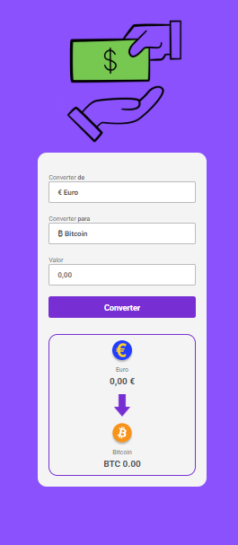
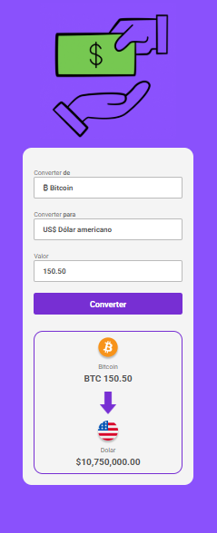

Este projeto é um conversor de moedas desenvolvido durante o curso DevClub, mas com implementações personalizadas que vão além do escopo básico do exercício original.

## 🚀 Melhorias Implementadas

Diferente da versão padrão que foca em conversões estáticas, esta versão introduz funcionalidades avançadas de lógica e consumo de dados:

* **Consumo de API em Tempo Real:** Integração com a AwesomeAPI via `fetch` (Async/Await) para buscar as cotações atualizadas no exato momento da conversão.
* **Conversão Universal (Lógica de Ponte):** Lógica matemática dinâmica utilizando o Real como moeda-base, permitindo conversões precisas e cruzadas entre qualquer par de moedas (Dólar, Euro, Libra e Bitcoin).
* **Tratamento de Erros (Resiliência):** Implementação de blocos `try/catch` para capturar oscilações de rede ou indisponibilidade da API, fornecendo feedback amigável ao usuário e evitando quebras silenciosas da aplicação.
* **Código Escalável (Dicionários):** Organização de dados em objetos literais para siglas, bandeiras e idiomas. Isso elimina a necessidade de dezenas de estruturas condicionais (`if/else`), deixando o código limpo e facilitando a adição de novas moedas.
* **Interface Reativa:** Uso do evento `change` nos seletores para atualizar bandeiras e refazer o cálculo instantaneamente, mantendo a UI sempre sincronizada sem a necessidade de novos cliques.
* **Internacionalização (Intl):** Formatação dinâmica de localidade e moeda (`en-US`, `pt-BR`, `de-DE`, `en-GB`), garantindo que os símbolos numéricos sigam as regras financeiras de cada país.

## 🛠 Tecnologias Utilizadas

* **HTML5:** Estrutura semântica.
* **CSS3:** Estilização moderna e responsiva.
* **JavaScript (ES6+):** Consumo de API REST, Assincronicidade (Promises), Tratamento de Exceções, Manipulação de DOM e API de Internacionalização.

## 📸 Screenshots

Aqui estão os destaques do funcionamento do projeto:

### 1. Conversão Dinâmica e Formatação de Moeda

### 2. Sincronia de Interface e Bandeiras

---
Desenvolvido por **Victor** como parte do portfólio de transição de carreira para Front-End Developer.
